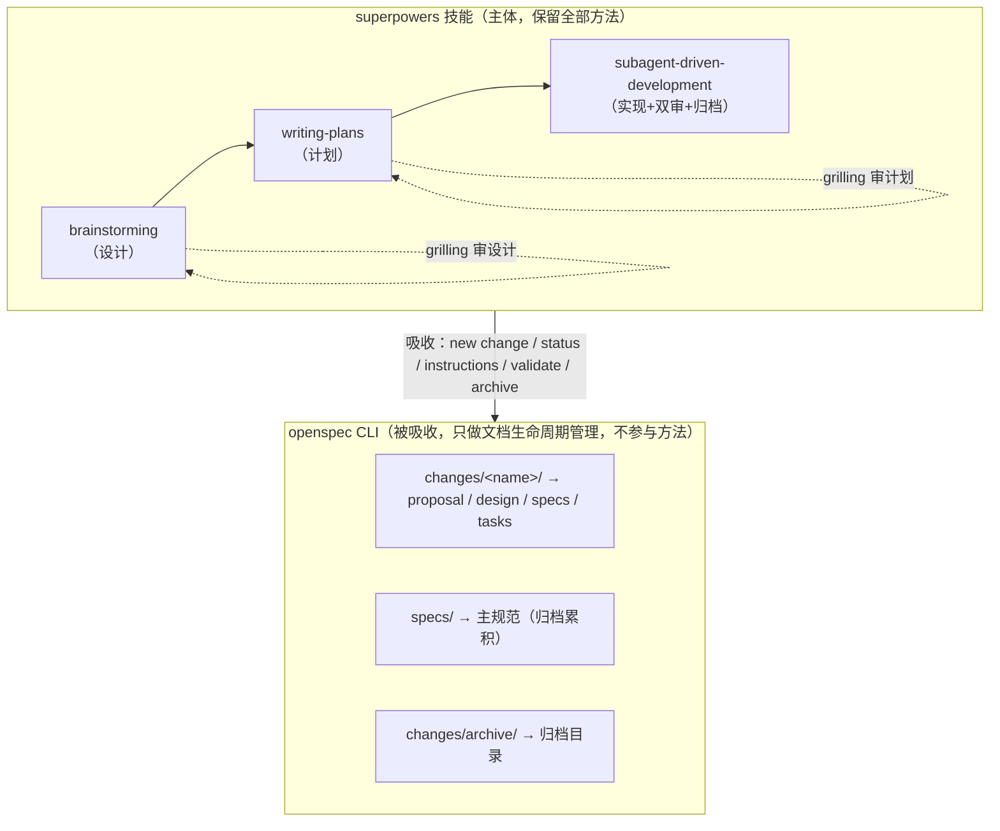
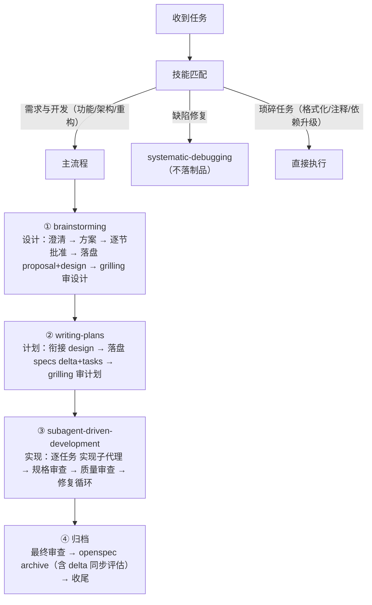

# 融合工作流：superpowers 方法 × openspec 制品

> 本工作流以 superpowers 技能为主体（保证"想清楚、做对"），吸收 openspec CLI 作为文档生命周期管理（保证"记清楚"）。本文档一份覆盖全部：第一部分为工作流介绍（理念与架构），第二部分为使用指南（从 0 接入与日常操作）。

---

# 第一部分 工作流介绍

## 1. 这是一条什么样的工作流

一条覆盖"需求 → 设计 → 计划 → 实现 → 验证 → 归档"全链路的工程开发流程。核心主张：

> **用 superpowers 的方法保证想清楚和做对，用 openspec 的制品保证记清楚。**

- **想清楚**：逐题澄清、2-3 方案对比、逐节批准、grilling 压力测试
- **做对**：每个实现任务经实现子代理 + 规格审查子代理 + 代码质量审查子代理三分离把关，缺陷在合入前被拦截
- **记清楚**：设计/计划/需求以结构化制品落盘（proposal/design/specs/tasks），可校验、可追溯、可归档沉淀

## 2. 为什么这样设计（动机）

对比纯 openspec 与纯 superpowers，短板互补：

| 方案 | 强项 | 短板 |
| --- | --- | --- |
| 纯 openspec（原版技能） | 文档标准化、状态追踪、归档知识库 | 无设计决策门（propose 一次生成全部）；实现自实现自勾选，无独立代码审查，需求漏实现难被发现 |
| 纯 superpowers | 方法成熟（澄清/方案/grilling/子代理双审） | 文档自由格式、无格式校验、无归档/主规范累积 |
| **本融合（推荐）** | 上述两者强项兼得 | 需同时维护两套能力（技能 + CLI） |

实测证据（透明容器功能双流程对比）：superpowers 流的子代理审查在合入前拦截 5 个代码缺陷；openspec 流程同类任务漏了 autoclose、生命周期回调等需求。融合正是为同时拿到"审查拦截"与"文档标准"。

## 3. 核心架构



**分工边界**：
- 方法（怎么澄清、怎么计划、怎么审查）——全部在 superpowers 技能内
- 落盘与校验（制品模板、格式校验、状态追踪、归档）——全部交给 openspec CLI
- openspec CLI 永不参与实现方法与审查决策

## 4. 完整工作流全景



## 5. 关键机制

### 5.1 双 grilling 决策门

| 门 | 位置 | 审的对象 | 触发 |
|:--|:--|:--|:--|
| 审设计 | brainstorming 尾部 | 架构、方案、决策、风险 | 进入计划前必须询问一次 |
| 审计划 | writing-plans 尾部 | 任务划分、实现步骤、边界漏洞 | 进入实现前必须询问一次 |

用户可拒绝任一 grilling，但不允许静默跳过。审出盲点必须修订对应制品后才能进入下一阶段。

### 5.2 三分离子代理审查（本工作流与纯 openspec 的关键差异）

每个实现任务分派三个**互不信任的独立子代理**：

```
实现子代理  → 按任务实现、验证、提交；汇报 DONE/BLOCKED/NEEDS_CONTEXT
规格审查子代理 → 独立逐行核对代码 ↔ tasks/specs，"不信任报告"；缺失/多余 → 修复 → 复审
代码质量审查子代理 → 独立找逻辑缺陷（关键/重要/次要）→ 修复 → 复审
```

审查者立场是"找茬"而非"走过场"——这是需求"做对"的保障。

### 5.3 完成标记

design.md 批准后追加 `## 已获用户批准` + 日期，防半成品被跳过（内容级完成判定）。

## 6. 制品体系

```
openspec/changes/<name>/
├── .openspec.yaml          # 变更元数据（openspec new change 创建）
├── proposal.md             # what & why（brainstorming 产出）
├── design.md               # how + 完成标记（brainstorming 产出）
├── specs/<capability>/spec.md  # 需求 delta（writing-plans 产出）
└── tasks.md                # 实现步骤（writing-plans 产出）

openspec/specs/<capability>/spec.md   # 主规范（归档时 delta 增量累积）
openspec/changes/archive/             # 归档目录（subagent 末尾 openspec archive）
```

制品是**阶段间的唯一接口**：设计交给计划的是 proposal/design，计划交给实现的是 specs/tasks，实现沉淀的是归档后的主规范。

## 7. 设计取舍

| 决策 | 理由 |
| --- | --- |
| superpowers 为主体 | 执行质量由子代理审查保障（实测拦截缺陷），openspec 原版技能缺此环 |
| openspec 只做落盘/校验 | 避免 openspec 参与方法；CLI 升级/重装不影响技能 |
| 设计/计划两阶段而非 propose 一步 | 中间隔 grilling 决策门，设计获批后才生成计划 |
| 原版 openspec 技能与 opsx 命令退役 | 职责被三技能吸收，避免双入口与流程漂移 |
| 降级开关 | 工作流不绑架工程，无 openspec 也可用 |

## 8. 适用边界

- **走主流程**：需求模糊的功能开发、架构调整、重构（多文件、有设计决策）
- **不走主流程**：缺陷修复（systematic-debugging）、琐碎任务（格式化/注释/无 API 变更的依赖升级）
- **判断原则**：有设计决策要拍板、有多步实现要验证、有知识要沉淀 → 主流程；否则走轻量路径

---

# 第二部分 使用指南

## 9. 前置条件

| 依赖 | 说明 |
| --- | --- |
| **openspec CLI** | 文档生命周期管理（创建变更、取模板、校验、归档）。**版本锚定：1.8.0**（本文档命令已按 1.8.0 实测），安装命令与版本约定见 [01-安装与更新](./01-安装与更新.md)；升级/降级需重新核对本文档命令 |
| **superpowers 三技能** | 已改造的 `brainstorming` / `writing-plans` / `subagent-driven-development`（含子代理提示词模板 `implementer-prompt.md` / `spec-reviewer-prompt.md` / `code-quality-reviewer-prompt.md`），以及它们依赖的 `systematic-debugging`、`finishing-a-development-branch` 等。**grilling 不再内置**——使用官方全局版（已安装于 `~/.agents/skills/grilling`，英文设计树版，更准确），工程内技能按名直接调用即可 |

## 10. 从 0 接入（4 步）

### 步骤 1：初始化 openspec 工作区

在工程根目录执行：

```bash
openspec init --tools none
```

`--tools none` 只创建 `openspec/`（`config.yaml` + `changes/` + `specs/`），**不注入 openspec 原版技能和 opsx 命令**——它们已被 superpowers 三技能吸收，无需保留。若误用默认 `init` 会注入 `.claude/skills/openspec-*` 与 `.claude/commands/opsx/`，需手动清理。

可选：编辑 `openspec/config.yaml` 补充项目上下文：

```yaml
schema: spec-driven
context: |
  技术栈：Android Kotlin，多模块 Gradle
  约定：中文注释、UTF-8、Conventional Commits
```

### 步骤 2：安装 superpowers 技能

优先全局安装（含全部技能，覆盖本工作流依赖的 `brainstorming` / `writing-plans` / `subagent-driven-development` 及其提示词模板），工程内按技能名直接调用：

```bash
npx skills@latest add Small-Sagittarius/spec-superpowers -g -y
```

**离线/精简替代**：仅拷贝以下目录到工程的 `.claude/skills/`：

```
brainstorming/            （含吸收的 openspec 落盘逻辑）
writing-plans/            （含吸收的 specs/tasks 落盘逻辑）
subagent-driven-development/  （含子代理提示词模板 + openspec 归档逻辑）
systematic-debugging/     （缺陷修复路径）
finishing-a-development-branch/  （实现后收尾）
```

> **grilling 不在此清单内**：决策门使用官方全局版（`~/.agents/skills/grilling`），无需复制到工程。superpowers 三技能按技能名 `grilling` 调用，全局技能即可命中。

### 步骤 3：配置 CLAUDE.md

将仓库根目录 `CLAUDE.md`（superpowers 规则块模板，`<!-- superpowers:begin -->` 与 `<!-- superpowers:end -->` 哨兵标记之间的**完整内容**：核心规则、20 个技能清单、如何使用）注入工程根目录的 `CLAUDE.md`（或 codex 的 `AGENTS.md`）。注入方法见 [01-安装与更新](./01-安装与更新.md) 的"superpowers 规则块（CLAUDE.md 注入）"——保留 begin/end 哨兵，目标已含哨兵则跳过。

### 步骤 4：验证接入

跑一次最小验证：

```bash
openspec doctor          # 检查 CLI 与工作区健康
openspec status          # 应输出当前无 active change
```

在对话中触发技能：描述一个需求，观察是否进入 brainstorming（要求澄清问题），确认技能加载成功。

## 11. 跑一个完整任务

以下用"给列表组件加一个空态展示"为例，逐步操作。

### 阶段 1：brainstorming（设计）

1. **探索上下文**：查看项目结构、相关代码、最近 commit
2. **逐题澄清**：一次一问（空态文案来源？触发条件？可配置？），了解目的/约束/成功标准
3. **2-3 方案对比**：先展示推荐方案与理由，再给备选（内置 vs 插槽）
4. **逐节批准**：按复杂度分节展示设计，每节确认
5. **落盘 openspec 制品**：
   ```bash
   openspec new change add-empty-state          # 无则创建变更目录（命名规则见 §13）
   openspec status --change add-empty-state --json    # 确认 proposal/design 依赖 ready
   openspec instructions proposal --change add-empty-state --json    # 取模板/规则
   openspec instructions design --change add-empty-state --json
   ```
   按模板写 `openspec/changes/add-empty-state/proposal.md` + `design.md`，design.md 末尾追加：
   ```markdown
   ## 已获用户批准
   日期：YYYY-MM-DD
   ```
   ```bash
   openspec validate add-empty-state             # 格式兜底（需指定变更名）
   ```
6. **grilling 审设计**：询问用户是否压测；审出盲点修订 design（如"分页边界空态"）

### 阶段 2：writing-plans（计划）

1. **衔接**：`openspec status --change add-empty-state --json`（确认 design done）
2. **规格化输出**：
   ```bash
   openspec instructions specs --change add-empty-state --json
   openspec instructions tasks --change add-empty-state --json
   ```
   写 `specs/list/spec.md`（`## ADDED Requirements` + `#### Scenario:`）+ `tasks.md`（`- [ ]` 任务，各含验证步骤/精确路径/2-5 分钟粒度/测试步骤）
   ```bash
   openspec validate add-empty-state && openspec status   # 确认 applyRequires 全部 done
   ```
3. **grilling 审计划**：询问用户是否压测；审任务划分/边界漏洞

### 阶段 3：subagent-driven-development（实现）

1. **读取制品**：`openspec instructions apply --change add-empty-state --json` 拿 contextFiles，读取 proposal/specs/design/tasks
2. **逐任务**：分派实现子代理 → 规格审查子代理 → 质量审查子代理 → 修复循环 → 证据过关才勾选 `- [x]`
3. **实现中设计问题**：暂停，修订制品保持一致，再回来继续

### 阶段 4：归档

1. **最终审查**：全部任务完成后，分派最终代码审查子代理审查整体实现
2. **归档**（`openspec archive` 原生同步 delta 到主规范并默认校验，**无需手动合并**；agent 非交互语境必须加 `--yes`，否则 `Proceed with spec updates?` 读不到 stdin 会失败）：
   ```bash
   openspec status --change add-empty-state --json   # 检查完成度
   openspec archive add-empty-state --yes            # 同步 delta + 校验 + 归档到 archive/YYYY-MM-DD-add-empty-state/
   ```
   不想同步 delta 的变更（纯基建/工具/仅文档）用 `openspec archive add-empty-state --skip-specs`（免确认）
3. **收尾**：`finishing-a-development-branch`（合并/PR/清理决策）

## 12. 技能操作细则（改造后）

| 技能 | 主体方法（保留） | openspec 吸收点（新增） | 降级回退 |
| --- | --- | --- | --- |
| **brainstorming** | 探索/澄清/方案对比/逐节批准/自检/grilling | 设计落盘：`new change`→`status`→`instructions proposal,design`→写 proposal+design（含批准标记）→`validate` | docs 设计文档 |
| **writing-plans** | 范围检查/文件结构/任务分解/TDD/自检/grilling | 计划落盘：`status`→`instructions specs,tasks`→写 specs delta+tasks→`validate`+`status` | docs 计划 |
| **subagent-driven-development** | 三分离子代理/修复循环/模型选择/最终审查 | 输入 `instructions apply` 拿 contextFiles；归档 `openspec archive <name> --yes`（原生同步 delta + 默认校验；不想同步用 `--skip-specs`）；实现中设计问题→更新制品 | docs 计划 + 不归档 |

## 13. openspec CLI 命令速查

| 命令 | 用途 |
| --- | --- |
| `openspec init --tools none` | 初始化工作区（不注入原版技能） |
| `openspec doctor` | 检查 CLI 与工作区健康 |
| `openspec new change <name>` | 创建变更目录（.openspec.yaml）。**命名规则（1.8.0）**：只限小写字母/数字/连字符，日期前缀可用（如 `2026-08-13-add-empty-state`）。建议 `<topic>` 或 `<capability>-<topic>` |
| `openspec status --change <name> --json` | 制品状态/依赖顺序/完成度 |
| `openspec instructions <artifact> --change <name> --json` | 取制品模板/规则/依赖 |
| `openspec validate <name>` | 校验指定变更的制品格式（裸 validate 无参会进入交互选择；校验范围可用 `--changes`/`--all`/`--specs`） |
| `openspec list --json` | 列出变更 |
| `openspec archive <name> --yes` | 归档变更到 archive/；原生同步 delta + 默认校验。**agent 非交互语境必须 `--yes`**（否则 spec 更新确认读不到 stdin 失败） |
| `openspec archive <name> --skip-specs` | 归档但不同步 delta（纯基建/工具/仅文档变更），免确认 |

## 14. 降级模式（无 openspec）

三技能在检测不到 openspec 时自动回退，**工作流照常可用**：

| 技能 | 降级行为 |
| --- | --- |
| brainstorming | 设计文档写 `docs/superpowers/specs/YYYY-MM-DD-<topic>-design.md` |
| writing-plans | 计划写 `docs/superpowers/plans/YYYY-MM-DD-<feature-name>.md` |
| subagent-driven-development | 读 docs 计划，无归档步骤 |

降级保留全部方法（澄清/grilling/子代理双审），只是失去 openspec 的格式校验与归档沉淀。要恢复标准模式：`openspec init --tools none` 即可。

## 15. 常见问题

| 问题 | 处理 |
| --- | --- |
| `openspec: command not found` | 未安装 CLI；先安装（全局或 npx），技能会自动检测降级 |
| 误注入 openspec 原版技能/opsx 命令 | 删除 `.claude/skills/openspec-*` 与 `.claude/commands/opsx/` |
| `openspec validate` 报 delta 格式错误 | 检查 specs delta 的 `## ADDED/... Requirements` 与 `#### Scenario:` 格式 |
| 归档报 `xxx ADDED failed for header ... already exists` 且 Aborted | 原因：归档前手动把 delta 合并进了主规范，CLI 检测到需求已存在会中止。处理：撤销主规范中的手动合并内容，直接 `openspec archive <name> --yes` 让它原生同步+校验 |
| 变更目录已存在 | `openspec new change` 会报 `already exists`（无 `--force`，非交互下不询问）；直接复用已有目录，跳过 new change |
| tasks 缺验证步骤 | writing-plans 阶段保证；subagent 遇到缺验证步骤的任务应暂停询问 |
| 子代理审查误报 | 控制者亲自核查（读代码/grep），不盲信审查报告；审查是强信号非终审 |
| 迁移到新工程 | 拷贝三技能 + 提示词模板到新工程 `.claude/skills/`，`openspec init --tools none`，配置 CLAUDE.md |

## 16. 迁移（工程 → 工程）

1. 拷贝 `.claude/skills/` 下改造后三技能 + 提示词模板到新工程
2. 新工程执行 `openspec init --tools none`
3. 新工程注入完整 superpowers 规则块（哨兵标记之间内容）+ 粘贴融合工作流规则块（见步骤 3 模板）
4. openspec CLI 升级/重装不影响技能；无恢复配方
